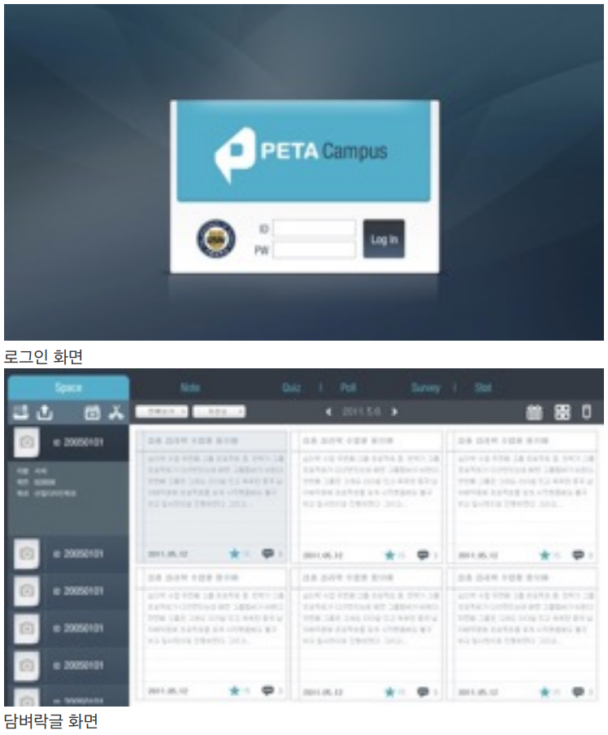
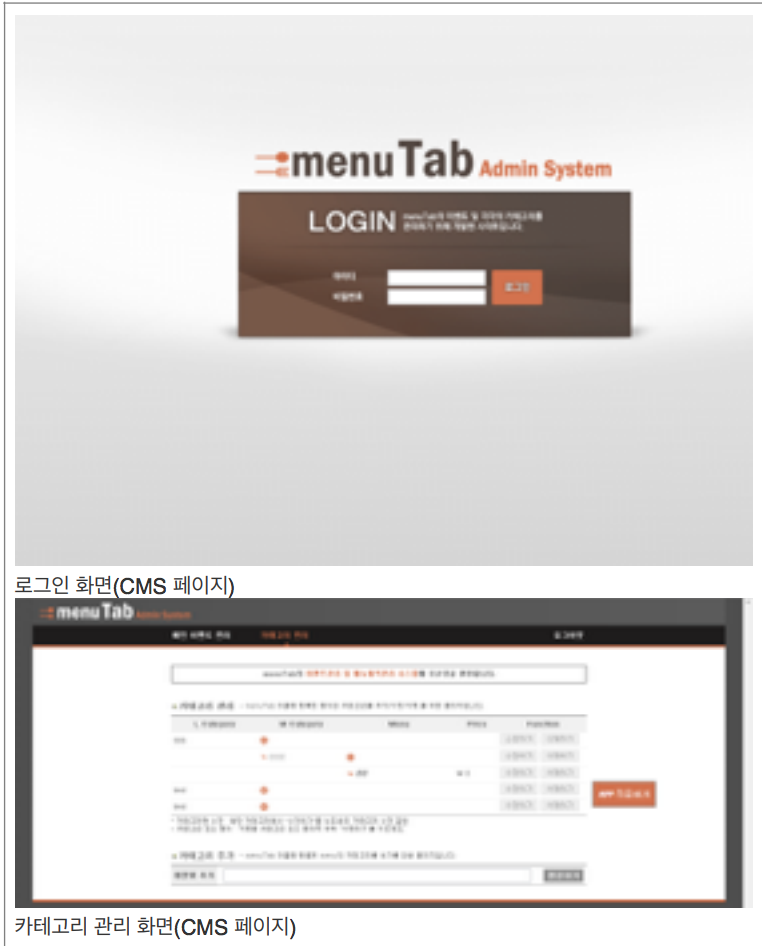
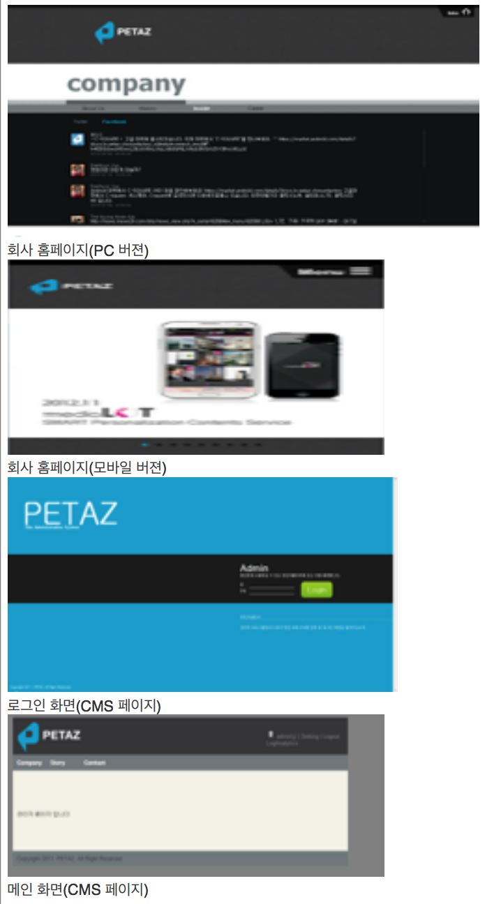
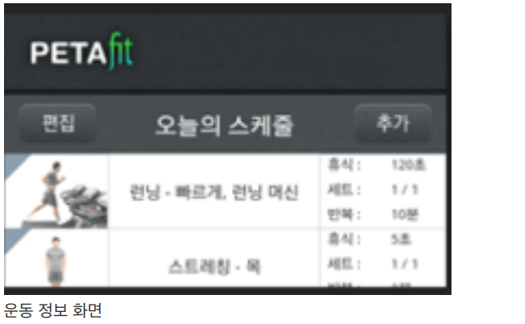

# 2011.05~2011.12



**2011. 05 ~ 2011. 06 Peta Campus\(Beta\) \[의뢰 회사 : LG U+\]**

 DB 연동 및 API 개발

→ DB에 있는 값을 XML형식으로 가공하여 안드로이드 어플리케이션 개발 시 데이터를 파싱해 올 수 있게 함. 

개발환경 : MySQL, PHP

**1. 로그인 기능** 

✓ 단말에서 ID,PW를 입력하면 DB에 있는 데이터를 비교 후 다음 화면 진입 할 수 있도록 PHP로 XML 형식에 맞 게 데이터를 뿌려줌. 

**2. 설문조사, 퀴즈, 담벼락\(게시판\) 글 쓰기, 글 수정하기, 삭제하기, 글 확 인하기 기능**

 ✓ 단말에서 글을 쓸 경우 DB에 데이터 를 삽입, 수정, 삭제, 확인이 가능하게 PHP로 쿼리문을 처리할 수 있도록 구 현함. 

✓ 단말에서 글을 확인할 수 있도록 로그인 화면 XML 형식에 맞게 데이터를 뿌려줌.



**2011. 06 ~ 2011. 08 MenuTab\[의뢰 회사 : 삼성\]**

 CMS\(Content Management Service\) 페이지 제작

 → 안드로이드 어플리케이션에 들어가는 데이터를 CMS페이지에서 DB에 저장함. 

DB 설계 API 개발 HTML 코딩 및 DB연동 

개발 환경 : HTML,CSS,JAVASCRIPT,MYSQL,PHP

**1. 로그인 기능\(단말\)** 

✓ 단말에서 ID,PW를 입력하면 DB에 있 는 데이터를 비교 후 다음 화면 진입할 수 있도록 PHP로 XML 형식에 맞게 기능을 구현함. 

**2. 로그인 기능\(CMS페이지\)** 

**3. 음식점 메뉴, 가격 등의 정보 불러오기 기능\(단말\)** 

✓ 단말에서 필요한 데이터를 불러올 수 있도록 XML 형식에 맞게 기능을 구현 함. 

**4. 음식점 메뉴, 가격 등의 정보 입력, 수 정, 삭제, 불러오기 기능\(CMS페이지\)**

 ✓ 쇼핑몰 처럼 대분류, 중분류, 소분류로 나눠 데이터 입력, 뿌려 주기



**2011. 07 ~ 2011. 12 페타즈 홈페이지 리뉴얼 작업\[의뢰 회사 : 페타즈\]**

CMS\(Content Management Service\) 페이지 제작 

→ 홈페이지에 들어가는 데이터를 DB에 저장함. DB 설계 HTML 코딩 및 DB연동, 페이스북, 트위터 연동 

개발 환경 : HTML,CSS,JAVASCRIPT,MYSQL,PHP 

http://petaz.co.kr \(PC 버전\) 

http://petaz.co.kr/m/ \(모바일 버전\) 

**1. 회사 홈페이지\(PC 버젼, 모바일 버젼\)** 

✓ Facebook, Twitter 글 연동 

✓ 게시판 글 쓰기, 읽기 기능 

✓ 게시판 글 모아보기 기능

 ✓ 메일 보내기 기능 

2011. 08 ~ 2011. 10 Peta Fitness\[의뢰 회사 : 삼성\]2011. 08 ~ 2011. 10 Peta Fitness\[의뢰 회사 : 삼성\]2011. 08 ~ 2011. 10 Peta Fitness\[의뢰 회사 : 삼성\]2011. 08 ~ 2011. 10 Peta Fitness\[의뢰 회사 : 삼성\]

✓ 회사 소개, 게시판 글, 지도 등의 데이 터 입력, 수정, 삭제 기능 

✓ 글 입력시 HTML5의 localStorage 기능 구현으로 입력한 글 임시 저장이 가능함.



**2011. 08 ~ 2011. 10 Peta Fitness\[의뢰 회사 : 삼성\]**

 DB 작업

칼로리, 운동법 등등 단말에 필요한 DB 값 insert후 .dump파일 생성



