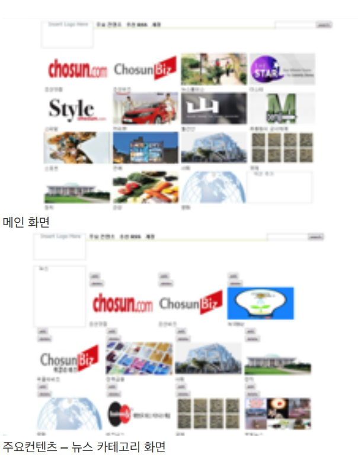
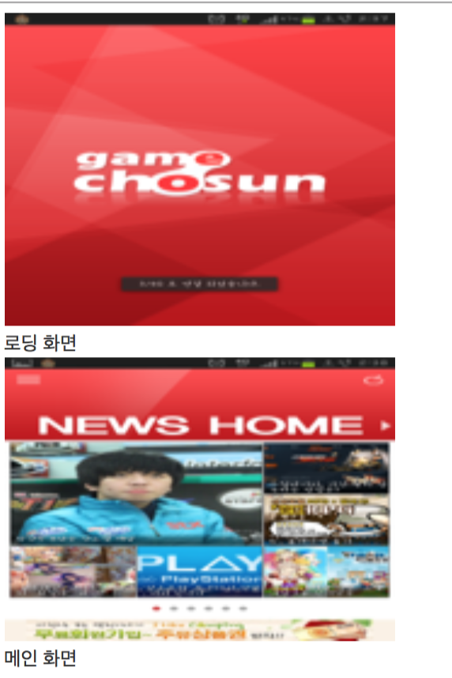

# 2012



**2012.02 ~ 2012.03 Peta Fitness\(모바일\) \[의뢰 회사 : 삼성\]**

HTML 코딩 

개발 환경 : HTML,CSS,JAVASCRIPT




**2011.08 ~2011.11 C-SQUARE \[의뢰 회사 : LG U+\]**

 DB 설계 및 작업 HTML 코딩 및 DB연동

개발 환경 : MYSQL,PHP

**1. 각 카테고리 별 데이터 불러오기\(단말\)**

 ✓ 단말에서 글을 확인할 수 있도록 XML 형식에 맞게 데이터를 뿌려줌. 

**2. 로고, 광고 등의 데이터 입력, 수정, 삭 제하기\(CMS페이지\)**



**2012.04 ~ 2012.05 MediaLot 웹버젼\(프로토 타입\) \[의뢰 회사 : 페타즈\]** 

HTML코딩 및 DB연동, RSS 파싱 

개발환경 : HTML,CSS,JAVASCRIPT,MySQL,PHP

**1. 섹션 추가, 삭제 기능** 

✓ HTML5의 WebStorage사용 

**2. 기사 내용 불러오기** 

✓ RSS파싱 

**3. 검색 기능** 

✓ 조선 닷컴 컨텐츠 내의 기사 

✓ 페이스북 그룹, 사용자 

✓ 트위터 사용자, 트윗글 

**4. 조선닷컴 컨텐츠 내의 데이터, 페이스북 사용자, 페이 지, 그룹, 검색** 

**5. RSS 주소 검색**

**6. 구글리더 검색 결과**



**2012.09 레이아웃 보완\(개인 개발\)** 

HTML코딩 및 DB연동, RSS 파싱 

개발환경 : HTML,CSS,JAVASCRIPT,MySQL,PHP

**1. 기사 내용 불러오기** 

✓ RSS파싱 

**2. 반응형 웹** 

**3. 미투데이 글 불러오기**



**2012.05 ~ 2012.05 MediaLot 랜딩 페이지 \(PC 및 모바일\) \[의뢰 회사 : 페타즈\]** 

기획 HTML코딩

개발환경 : HTML,CSS,JAVASCRIPT,PHP

1. **이미지 슬라이드**
2. **모바일/PC 구분 – 페이지 이동**
3. **메일 보내기 기능**



**2012.07 ~ 2012.07 게임조선 및** 

**여성조선 CMS 페이지 \(프로토 타입\) \[의뢰 회사 : 페타즈\]**

API 개발  
HTML코딩,DB설계 및 연동  
개발환경 : HTML,CSS,JAVASCRIPT,MySQL,PHP

1. **로그인 기능**
2. **사용자, 컨텐츠 등록, 수정, 삭제 기능**



**2012.07 ~ 2012.07 여성조선 API \[의뢰 회사 : 여성 조선\]**

API 개발  
 개발환경 : MySQL,PHP

**여성 조선 컨텐츠 데이터 불러오기**

**2012.08 ~ 2012.08 게임조선 API\(프로토 타입\)\[의뢰 회사 : 페타즈\]**

DB설계 및 연동  
API 개발  
개발환경 : MySQL,PHP

1. **로그인 기능**
2. **게임 조선 컨텐츠 불러오기**
3. **댓글쓰기 및 읽기**

**2012.10 ~ 2012.10 TV조선 API\(프로토 타입\) \[의뢰 회사 : 페타즈\]**

DB설계 API 개발

개발환경 :MySQL,PHP

1. **로그인 기능**
2. **TV 조선 컨텐츠 불러오기**





**2012. 03 ~ 2012.12 SMART CAMPUS\(모바일 및 태블릿\) \[의뢰 회사 : LG U+\]**

서버 환경 셋팅

→ DB2 드라이버 설치 HTML 코딩 및 DB연동 API 문서 작성

→ 개발에 필요한 뷰테이블을 제공 받기 위해 API 문서를 작성하여 수원대학교 전산원, 중앙 도서관에게 요청함. 

개발 환경 : HTML,CSS,DB2,JSP

**1. 수원 대학교 데이터\(식단 정보, 게시판, 성적 조회, 시 간표 조회\) 불러오기**

✓ \(웹뷰\) JSP로 DB데이터를 불러온 후 디자인에 맞춰 서 HTML로 코딩함.

✓ XML 형식으로 데이터 불러오기



**2013.01 SMART CAMPUS - 교수 관리자 페이지 \[의뢰 회사 : LG U+\]** 

HTML 코딩 및 DB연동  
 개발 환경 : HTML,CSS,DB2,JSP








