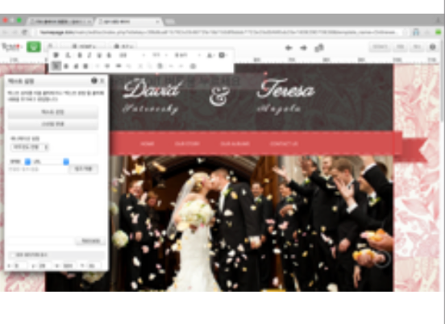
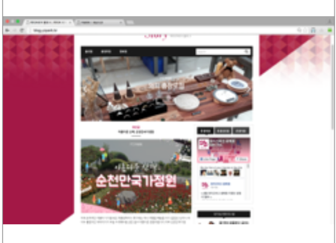
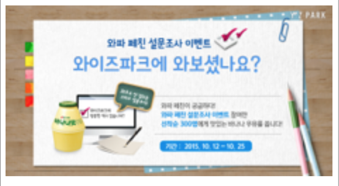
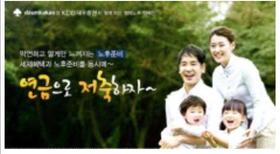
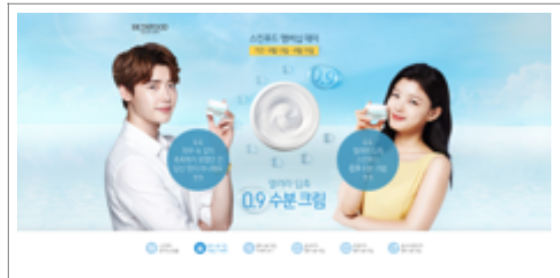
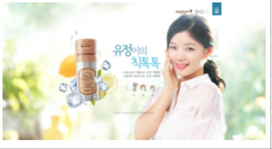
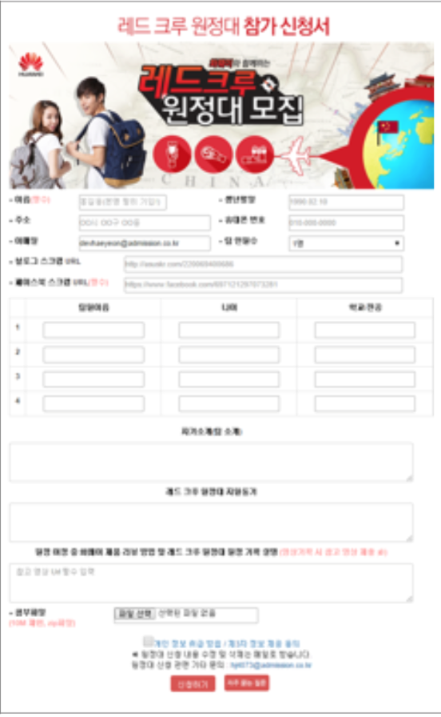

# 2015 ~ 2016



**2015.11 ~ 2016.06 김씨네 홈페이지 \[의뢰 회사 : 애드미션\]**

1. \`김씨네 홈페이지\` 솔루션 개발
2. \(http://homepage.kim\)
3. \`김씨네홈페이지\`는 윅스\(http://wix.com\)을 벤치

   마킹하여 클릭만으로 HTML을 몰라도 홈페이지를 쉽게 만들 수 있는 솔루션 입니다. 이를 기획, 설계, 설계에 참여함.

4. Jquery, Javascript, HTML, CSS, PHP, SHELL SCRIPT\(일부 조금\), Packer Lib를 통한 소스 난독화, MYSQL, AJAX\(jquery를 사용한 비 동기 통신\)
5. 사이트 기획 및 설계
6. 워드프레스 기반 사이트 홈페이지 적용 = 개발
7. 관리자 페이지 기획, 설계, 개발
8. \(관리자\) 회원 관리 페이지
9. \(관리자\) 소스 백업, 복구 페이지 적용 = 설계, 개발
10. 일부 쉘 스크립트 적용
11. 소스 packer 적용
12. 그누보드 기반 게시판, 플러그인 소스 커스텀 마이징

    하여 게시판, 블로그 모듈 적용 = 기획, 설계, 개발

13. \(관리자\) 게시판, 블로그 테마 추가 관리자 페이지

    개발 = 기획, 설계, 개발

14. 갤러리 모듈 적용
15. Gabia API를 사용한 도메인 연결, 도메인 구매 취

    소 적용

16. KG 모빌리언스 결제모듈 적용
17. phpmailer을 적용한 메일링 시스템 적용
18. Font Awesome 라이브러리 적용한 모듈 적용
19. \(관리자\) 템플릿 복제 페이지 개발
20. 일부 쉘스크립트 적용
21. 버그 수정\(유지보수\)
22. 서버 관리\(Linux\)



**2015.11 ~ 2016.06 와이즈 파크 블로그 제작 및 유지보수 \[의뢰 회사 : AMPLUS\]**

1.\`와이즈 파크\` 워드프레스 기반 블로그 제작

2. 워드 프레스 기반 블로그 적용  
 3. 워드 프레스 테마 커스텀 마이징  
 4. 서버 환경 구축, 테스트 환경 구축 유지보수



**2015.11 ~ 2016.06 와이즈 파크 홈페이지 유지보수 \[의뢰 회사 : AMPLUS\]**

\`와이즈 파크\` 홈페이지 유지보수\(jsp\)



2015.09 ~ 2015.09 와이즈파크 프로모션 페이지 제작 \[의뢰 회사 : AM플러스\]

1. **PC 및 모바일 퍼블리싱**
2. **와이즈파크 블로그 내 설문조사 기능 구현**
3. **이벤트 관리자 페이지 구현**



2015.09 ~ 2015.09 대우증권 프로모션 페이지 제작 \[의뢰 회사 : 대우증권\]

1. PC 및 모바일 퍼블리싱
2. 카카오톡 , 페이스북 공유하기 기능 구현



**2015.07 ~ 2015.07 스킨푸드 수분크림 프로모션 페이지 제작 \[의뢰 회사 : 스킨푸드\]**

1. PC 및 모바일 퍼블리싱
2. 카카오톡 , 페이스북 공유하기 기능 구현



2015.05 ~ 2015.05 스킨푸드 칙톡쿠션 프로모션 페이지 제작 \[의뢰 회사 : 스킨푸드\]

1. PC 및 모바일 퍼블리싱
2. 카카오톡 , 페이스북 공유하기 기능 구현



**2015.02 ~ 2015.02 레드크루 원정대 참가 신청 페이지 제작 \[의뢰 회사 : 화웨이\]**

1. PC 및 모바일 퍼블리싱
2. 파일 업로드
3. 페이스북 페이지 제작
4. 페이스북공유하기기능구현
5. 관리자 페이지 제작



